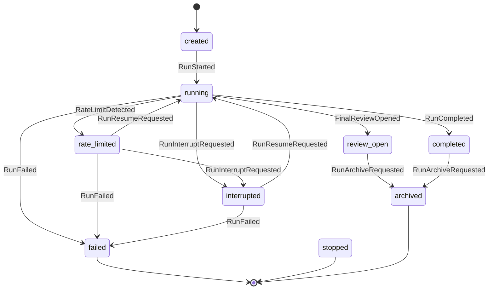
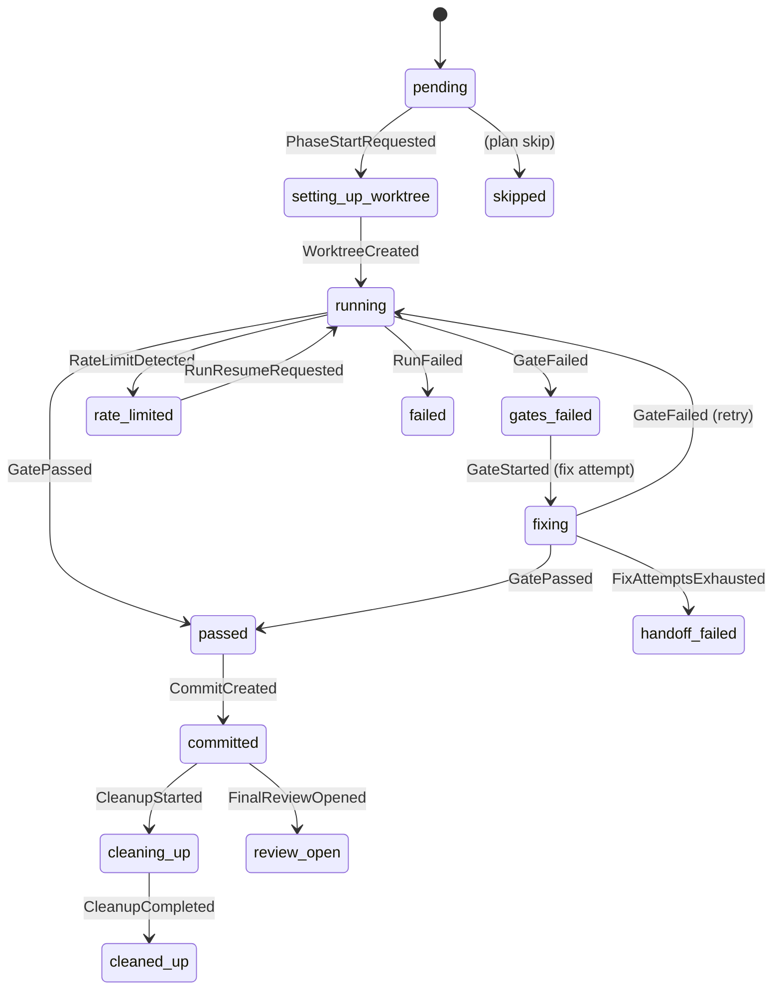

# phax State Machine

phax is an explicit hierarchical state machine. Every real-world signal (gate result, rate limit, agent completion, archive request) produces a typed `PhaxEvent`. The pure reducer `interpret(state, event)` returns a `Disposition` — `Handled`, `Ignored`, `Stale`, `Rejected`, or `Unexpected` — plus optional `PhaxCommand` effects to execute. The single `dispatch()` entry point is the only writer to `status.json` and `run-status.json`.

## Architecture

```
port call / CLI signal
        │
        ▼
  eventAdapter.ts        ← converts port results + errors → typed PhaxEvent
        │
        ▼
  dispatcher.ts          ← reads PhaxState, calls interpret(), writes state
        │
        ├── interpret(state, event)  ← pure reducer (domain/reducer.ts)
        │        └── returns Disposition { kind, nextState?, effects[] }
        │
        └── effectRunner.ts         ← executes PhaxCommand[] via ports
```

**Single-writer invariant**: only `dispatcher.ts` and `effectRunner.ts` import `encodePhaseStatus` / `encodeRunStatus`. Enforced by `tests/unit/architecturalGuards.test.ts`.

**Sanctioned bypass**: `interruptHandler.ts` writes `run-status.json` directly in a synchronous SIGINT/SIGTERM handler that cannot `await` the dispatcher.

## Hierarchical State

The machine has two nested levels:

```
PhaxState (run level)
  ├── created
  ├── running        { phase: PhaseSubState }
  ├── rate_limited   { phase: PhaseSubState }   ← phase frozen
  ├── interrupted    { phase: PhaseSubState }
  ├── review_open    { phase: { state: "review_open" } }
  ├── failed         { cause: string }
  ├── completed
  ├── stopped
  └── archived

PhaseSubState
  ├── pending
  ├── setting_up_worktree
  ├── running
  ├── gates_failed   { attempt: number }
  ├── fixing         { attempt: number }
  ├── passed
  ├── committed      { hash: string }
  ├── cleaning_up
  ├── cleaned_up
  ├── handoff_failed { missing: string[] }
  ├── failed         { cause: string }
  ├── skipped
  ├── rate_limited
  └── review_open
```

## Run-Level State Diagram



## Phase-Level State Diagram

(Active when run is `running`, `rate_limited`, or `interrupted`.)



## Event Vocabulary

All events share a base shape:

```typescript
interface PhaxEventBase {
  eventId: string; // unique per event
  occurredAt: string; // ISO-8601
  run: RunId;
  phase?: PhaseId;
  correlationId?: string;
}
```

### Run-shaped events

| Event                   | Trigger                                                      |
| ----------------------- | ------------------------------------------------------------ |
| `RunStarted`            | `phax run` initialises a new run                             |
| `RunResumeRequested`    | `phax resume` after rate-limit or interrupt                  |
| `RunInterruptRequested` | SIGINT / SIGTERM received                                    |
| `RunArchiveRequested`   | `phax archive` (carries `from` / `to` paths)                 |
| `RunFailed`             | unrecoverable error (carries `cause`)                        |
| `FinalReviewOpened`     | last phase finished; review worktree opened (carries `info`) |
| `RunCompleted`          | all phases done, no review phase                             |

### Phase-shaped events

| Event                      | Trigger                                                                     |
| -------------------------- | --------------------------------------------------------------------------- |
| `PhaseStartRequested`      | orchestrator starts the next phase (carries `phaseId`)                      |
| `WorktreeCreated`          | `git worktree add` succeeded (carries `path`)                               |
| `AgentInvocationStarted`   | Claude Code subprocess launched                                             |
| `AgentInvocationCompleted` | Claude Code subprocess exited (carries `sessionId`)                         |
| `GateStarted`              | gate suite begins (carries `attempt`)                                       |
| `GatePassed`               | all gate commands exited 0 (carries `attempt`)                              |
| `GateFailed`               | a gate command failed (carries `command`, `exitCode`, `logPath`, `attempt`) |
| `FixStarted`               | fix-loop iteration begins (carries `attempt`)                               |
| `FixCompleted`             | fix agent exited (carries `sessionId`)                                      |
| `FixAttemptsExhausted`     | max fix attempts reached without passing                                    |
| `HandoffRequested`         | orchestrator asks Claude to write `phase-handoff.md`                        |
| `HandoffValidated`         | handoff sections all present                                                |
| `HandoffMissing`           | handoff validation failed (carries `missingSections`)                       |
| `CommitCreated`            | `git commit` succeeded (carries `hash`)                                     |
| `CleanupStarted`           | cleanup shell commands starting                                             |
| `CleanupCompleted`         | worktree removed, cleanup done                                              |

### Cross-cutting

| Event               | Trigger                                                                                                                |
| ------------------- | ---------------------------------------------------------------------------------------------------------------------- |
| `RateLimitDetected` | `RateLimitError` or `UsageLimitError` from Claude (carries `kind`, `resetAt?`, `cause`, `worktreePath?`, `sessionId?`) |

## Dispositions

Every `(state, event)` pair produces exactly one of:

| Kind         | Meaning                                                                                                         |
| ------------ | --------------------------------------------------------------------------------------------------------------- |
| `Handled`    | transition applied; `nextState` + `effects` populated                                                           |
| `Ignored`    | event valid but no state change needed (e.g. duplicate `RunResumeRequested` while already running)              |
| `Stale`      | event arrived after the machine moved past the state it targets (e.g. `GateFailed` against a `committed` phase) |
| `Rejected`   | event is illegal in this state (e.g. `RunStarted` while `running`)                                              |
| `Unexpected` | event should never occur here — signals a bug in the caller                                                     |

The disposition is emitted as a trace event (`event.handled`, `event.ignored`, `event.stale`, `event.rejected`, `event.unexpected`), now the only signal of a state change, carrying `{ stateBefore, eventType, disposition, reason, eventId, correlationId }`.

## Event-Disposition Matrix

The compile-time `phaxDispositionMatrix` in `src/domain/matrix.ts` declares the expected disposition kind for every `(run-state, event)` pair. TypeScript's `satisfies` keyword rejects any missing cell.

| Event ↓ / Run state →      | created | running | rate_limited | interrupted | review_open | failed | completed | stopped | archived |
| -------------------------- | ------- | ------- | ------------ | ----------- | ----------- | ------ | --------- | ------- | -------- |
| `RunStarted`               | **H**   | R       | R            | R           | R           | R      | R         | R       | R        |
| `RunResumeRequested`       | R       | I       | **H**        | **H**       | R           | R      | R         | R       | R        |
| `RunInterruptRequested`    | R       | **H**   | **H**        | I           | R           | R      | R         | R       | R        |
| `RunArchiveRequested`      | R       | R       | R            | R           | **H**       | R      | **H**     | R       | R        |
| `RunFailed`                | R       | **H**   | **H**        | **H**       | R           | I      | R         | R       | R        |
| `FinalReviewOpened`        | U       | U       | U            | U           | I           | R      | R         | R       | R        |
| `RunCompleted`             | U       | **H**   | R            | R           | R           | R      | I         | R       | R        |
| `PhaseStartRequested`      | R       | I       | R            | R           | R           | S      | S         | S       | S        |
| `WorktreeCreated`          | U       | I       | S            | S           | S           | S      | S         | S       | S        |
| `AgentInvocationStarted`   | U       | **H**   | U            | S           | U           | S      | S         | S       | S        |
| `AgentInvocationCompleted` | U       | **H**   | S            | S           | U           | S      | S         | S       | S        |
| `GateStarted`              | U       | **H**   | U            | S           | U           | S      | S         | S       | S        |
| `GatePassed`               | U       | **H**   | S            | S           | U           | S      | S         | S       | S        |
| `GateFailed`               | U       | **H**   | S            | S           | U           | S      | S         | S       | S        |
| `FixStarted`               | U       | U       | U            | S           | U           | S      | S         | S       | S        |
| `FixCompleted`             | U       | U       | S            | S           | U           | S      | S         | S       | S        |
| `FixAttemptsExhausted`     | U       | U       | S            | S           | U           | S      | S         | S       | S        |
| `HandoffRequested`         | U       | U       | U            | S           | U           | S      | S         | S       | S        |
| `HandoffValidated`         | U       | U       | U            | S           | U           | S      | S         | S       | S        |
| `HandoffMissing`           | U       | U       | U            | S           | U           | S      | S         | S       | S        |
| `CommitCreated`            | U       | U       | U            | S           | U           | S      | S         | S       | S        |
| `CleanupStarted`           | U       | U       | U            | S           | U           | S      | S         | S       | S        |
| `CleanupCompleted`         | U       | U       | S            | S           | U           | S      | S         | S       | S        |
| `RateLimitDetected`        | U       | **H**   | I            | I           | S           | S      | S         | S       | S        |

**H** = Handled, **I** = Ignored, **S** = Stale, **R** = Rejected, **U** = Unexpected

> Note: cells for `running` and `rate_limited` / `interrupted` reflect the _canonical_ phase substate (`running`). Phase-substates like `committed` or `cleaned_up` may produce a different kind — the reducer is the source of truth.

## Effect Commands

The reducer emits `PhaxCommand[]` for `Handled` dispositions. The effect runner executes them in order:

| Command                                    | Effect                                             |
| ------------------------------------------ | -------------------------------------------------- |
| `PersistState { patch }`                   | write `run-status.json` + `status.json` atomically |
| `EmitTrace { name, status, details }`      | append to `trace.jsonl` via the `Tracer` port      |
| `WriteResumeInstructions { ctx }`          | write `resume.md` with rate-limit context          |
| `RemoveWorktree { path, force, repoRoot }` | `git worktree remove`                              |
| `RunCleanupShell { commands, cwd }`        | execute cleanup shell commands sequentially        |
| `WriteAtomic { path, content }`            | `FileSystem.writeAtomic`                           |
| `OpenRunReview { info }`                   | open review worktree, write `review-handoff.md`    |
| `WriteFinalReport { info }`                | write final report                                 |
| `MoveRunToArchive { from, to }`            | rename run directory                               |
| `RecordCommitMetadata { hash }`            | write commit hash to phase metadata                |

## Happy-Path Trace Sequence

For a single-phase run, `trace.jsonl` must contain these events in order:

```
event.handled        RunStarted              run: created → running
event.handled        PhaseStartRequested     phase: pending → setting_up_worktree
git.worktree.created
event.handled        WorktreeCreated         phase: setting_up_worktree → running
agent.invocation.started
agent.invocation.completed
agent.session.captured
event.handled        AgentInvocationCompleted (no phase transition)
gate.started
gate.completed
event.handled        GatePassed              phase: running → passed
handoff.requested
handoff.validated
event.handled        HandoffValidated        (no phase transition)
git.commit.created
event.handled        CommitCreated           phase: passed → committed
event.handled        CleanupStarted          phase: committed → cleaning_up
event.handled        CleanupCompleted        phase: cleaning_up → cleaned_up
event.handled        FinalReviewOpened       run: running → review_open
```

A `Stale` or `Rejected` event must leave `status.json` byte-identical — proving the doctrine's "absence of transition is itself an explicit decision."

## How to Add a New Signal

1. **Define the event** in `src/domain/events.ts` — extend the `PhaxEvent` union.
2. **Add matrix cells** in `src/domain/matrix.ts` — one column for every run-state. TypeScript will refuse to compile until all cells are filled.
3. **Add reducer branches** in `src/domain/reducer.ts` — handle the new event type in each run-state's switch case. Return `Handled`, `Ignored`, `Stale`, `Rejected`, or `Unexpected` as declared in the matrix.
4. **Add unit tests** in `tests/unit/reducer.test.ts` — cover the non-trivial branches; confirm matrix agreement.
5. **Add an adapter** in `src/app/eventAdapter.ts` if the signal originates from a port call (success or error path).
6. **Emit the event** from the orchestrator or the relevant app module via `dispatch(newEvent(...))`.
7. **Run the verification suite**:
   ```bash
   pnpm typecheck && pnpm test:unit && pnpm test:integration && pnpm knip && pnpm lint
   ```
   The phase-00 snapshots in `tests/integration/__snapshots__/` are the regression contract — they must remain byte-identical unless the new signal intentionally changes observable output.
